```{r global_options, include=FALSE}
knitr::opts_chunk$set(fig.pos = 'H')
```

# Introduction

The current study serves as an enhancement to Dr. Michael Barresi’s research at Smith College on categorizing zebrafish brains. The goal of the biological sciences research is to use the commissure, an axonal bridge formed to connect the two hemispheres of the brain, to classify whether a certain zebrafish belongs to wild- or mutant-type group.    

The difference between wild- and mutant-type brain structure is shown in Figure 1. Wild-type zebrafish have a smooth parabolic-shaped commissure, where as in mutant zebrafish, the commissure is either not fully developed or highly distorted.


```{r Figure1, echo =FALSE, fig.cap="Wild-type and mutant-type commissure", out.width='90%', fig.show='asis'}
knitr::include_graphics("visualization_paper/wt_yt.png")
```


During the classification process, Dr. Barresi’s lab could only perform categorization based on empirical knowledge. As a result, Morgan Schwartz, a former lab member, wrote a Python program called $\Delta$ SCOPE to:     
1. Align crooked 3D biological images so they could compare between samples           
2. Generate descriptive graphs with sample statistics        
3. Classify samples into either wild type or mutant type based on the statistics[@Schwartz18] [@Hu18].       

Our goal is to implement the Python program into R while maintaining and improving as many features as possible. We modified existing functions in `Cranium` package [@cranium], built new functions, and optimized parameters so that evaluating sample alignments is no longer vulnerable to subjective biases. Additionally, alignments will be able to run automatically without labor-intensive manual correction that would introduce more researcher biases.


# Data
We received our data from Dr. Jake Schnabl. The data files are brain images of 43 wild-type samples and 35 mutant samples in HDF5 (.h5) format. The data points stored within those files are marked using by fluorescence microscopy, indicating neuronal signals. The data is processed by an open-source software, Ilastik, before being read into R. We are working with the data after being processed in Ilastik.      

Raw image data was processed in `Illastik`. Each sample is composed of data points, which are voxels of the image. Voxels stand for volumetric pixels, which can be understood as the three-dimensional equivalent of pixels. Each voxel has a frequency, representing the probability of being a real signal.    

# Programming Languages
In this study, we used R in order to run algorithms, manipulate data, and generate visualizations. For accessibility and reproducibility of this research, we have stored our work on Github. [@rticles19]

## Package `Cranium`
The package `Cranium` contains several major functionalities listed below:


# Functionalities
## 1.API
The sample datasets for wild- and mutant-type are saved as `*.h5` files. Originally, the lab had to share the data through a hard drive, thus having a need for readily accessible data. In order to share the data efficiently amongst users, the data is hosted on Amazon S3 with a read only link to each sample. In the `Cranium` package,  functions were created that allows users to download an individual sample or a bundle of samples. Each function downloads all existing files onto the user’s machine in a designated folder the user decides in addition to outputting the list of samples of type brain class. 

## 2. Tidy Data and Threshold
After reading the data, we organize the dataset using a tidy framework for data manipulation, which has a specific structure: each row is an observation and each column is a variable; in our case, `x,y,z` coordinates [@tidy-data]. After transforming the image data, each observation in our data is a voxel, and each voxel contains information about how strong that voxel is, which is referred to as frequency. Frequency represents the probability of each voxel being a real signal. We want to include as many “real” signals as possible while getting rid of voxels that are very likely to be “background noise.” Therefore, we want to set a threshold so that all the voxels that have frequencies below the threshold are considered as noise and excluded from our analysis. 

Wild-type samples and mutant-type samples originally contain different number of voxels. Because of the deformed nature of mutant-type commissures, mutant samples, on average, contain half or fewer voxels than that of wild type. Also, compared to wild-type samples, mutant-type samples’ voxels generally have lower frequencies. Setting a high threshold would not result in too small a sample size (i.e., signals) for the wild type because the wild-type commissures are mostly formed successfully and have relatively strong signals. However, a high threshold would result in mutant-type sample having a very restricted sample size because the wild-type commissures are mostly formed successfully and have relatively strong signals. 

For the purpose of research of Baressi’s Lab, we want to compare wild- and mutant-type sample, thus we have to set the same threshold for both types of samples. A threshold of 0.9 was subjectively chosen previously by observing the output of wild- and mutant-type samples, which raised our concern of the validity of this threshold. Therefore, we decided to 1. test for the validity of this 0.9 threshold by examining model fit; 2. find a threshold that will optimize the model fit. We fit a quadratic model on the x-y plane that captures the shape of the commissure, and we use the adjusted $R^2$ to evaluate the model fit. There are some problems we encounter during the optimization process: having small number of signals for mutant-type samples increases the chance of our model overfitting the data; meanwhile, setting a low threshold for mutant-type samples increases the the chance of noise to creep into the dataset. Therefore, our goal is find the optimized threshold that fit the data well by capturing the real signals, while ensuring that we have enough mutant-type signals. 

To find the optimal threshold, we test different thresholds and examine their model fit according the following procedures:     
1. Starting with one threshold, we fit one model to every single sample and repeat fitting the model for all wild- and mutant-type samples. We then evaluate the model fit at this specific threshold by respectively taking the average $R^2$ of the wild-type and of the mutant-type samples.     
2. Next, we repeat step 1. for other thresholds: {0.4, 0.42, 0.44, 0.46, 0.48,  0.5, 0.52, 0.54, 0.56, 0.58, 0.6, 0.62, 0.64, 0.66,  0.7, 0.75, 0.8, 0.81, 0.82, 0.83, 0.84, 0.85, 0.86, 0.87, 0.88, 0.89, 0.90, 0.91, 0.92}.      
3. For each threshold, we generate a table of the threshold which we listed at step 2. with its corresponding average adjusted $R^2$ for wild-type samples and average adjusted $R^2$ for mutant-type samples.

In order to find the threshold that optimizes the average adjusted $R^2$ for both wild- and mutant-type samples, we generate a scatterplot, as shown in Figure 2, for each threshold value, which is represented by a distinct color. The use of lighter color indicates a higher threshold. The size of each point represents the amount of signals from the mutant-type sample that were captured by the model. With x-axis representing the average mutant-type adjusted $R^2$ and y-axis representing the average wild-type adjusted $R^2$, we are able to find the optimal threshold.     


```{r Figure2, echo =FALSE, fig.cap="Optimization of threshold for wild- and mutant-type samples", out.width='90%', fig.show='asis'}
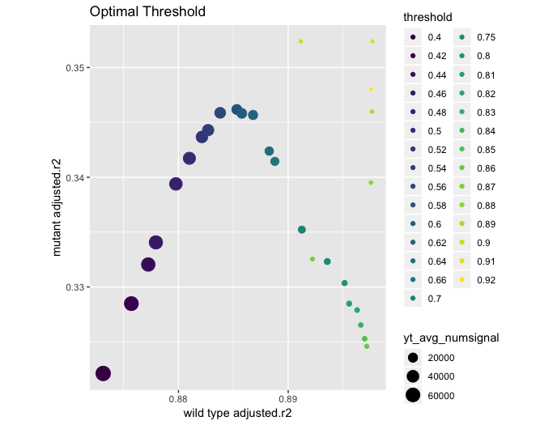
```


We evaluate the performance of each threshold by comparing it to the perfect model fit. A perfect model-fit for both wild- and mutant-type samples should achieve an adjusted $R^2 = 1$. In a two dimensional space, we can find the Euclidean distance between the model fit of our threshold and the perfect model fit. A smaller euclidean distance indicates that we are closer to the perfect model fit. 

## 3. Principal Component Analysis (PCA) Reorientation
During the process of data collection, researchers took pictures of the zebrafish brain under microscopes. We acknowledge that each of the brains were in different positions and were placed in different angles. Therefore, the pictures varied slightly in positioning. In order for us to do further analyses and compare between samples, we need to re-orient them using Principal Component Analysis (PCA) and identify a consistent set of axes across all samples. 
In a three-dimensional space, PCA assigns the axis with the most amount of variation as PC1 (first principal component), then the axis with the second-most variation as PC2, and lastly the axis with least amount of variation as PC3. Afterwards, PCA picks the basis based on  PC1, PC2, and PC2, which then changes the positioning of the structure. As shown in Figure 3, we graphically output three 2D planes in three perspectives: xy; yz; xz planes. For the commissure, we would get three views: lateral; dorsal/ventral; anterior/posterior. We set x axis as the lateral, y axis as the anterior/posterior, and z as the dorsal/ventral.        


```{r Figure3, echo=FALSE, fig.cap="2D plot of a wild-type sample", out.width='100%', fig.show='asis'}
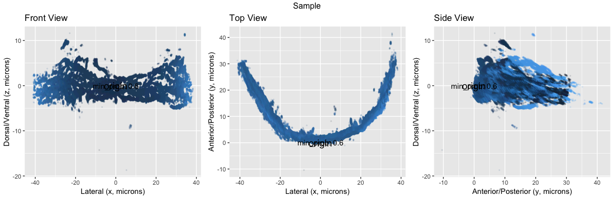
```


## 4. Qmodel   
We built the Qmodel function to fit a quadratic model to the data in order to capture the shape of the commissure as well as evaluating model fit. As shown in the Figure 4, the quadratic model fits on the xy-plane:  $y=x^2+x$, indicated by red color. Our goal is to achieve a better model fit. Qmodel outputs model statistics including: $R^2$, adjusted $R^2$, sigmal (RSE), statistic, p.value, df, logLik, AIC, BIC, deviance, df.residual, num.signal, quad.coeff, RMSE.    


```{r Figure4, echo=FALSE, fig.cap="Model fit on a wild-type sample", out.width='100%', fig.show='asis'}
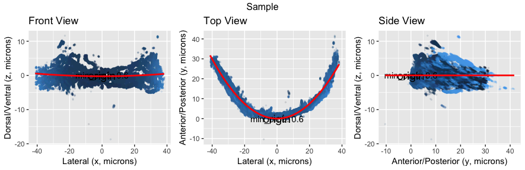
```
 

### $R^2$ : 
$R^2$ is also called the coefficient of determination or the coefficient of multiple determination for multiple regression. $R^2$ ranges from 0 to 1.  It is calculated from the variance explained by the model divided by total variance. Higher $R^2$ values represent smaller differences between the observed data and the fitted values, indicating a better fit of the model. Note that $R^2$ is a relative scale of model fit.

### Adjusted $R^2$ : 
Adjusted $R^2$ is a modification of $R^2$ and adjusts for the number of predictors in the model. 

### RMSE (Root Mean Squared Error)
gives the difference between observed data and model’s predicted values. Lower RMSE values represent smaller difference between observed data and model’s predicted values.

### num.signal 
It gives the number of signals being captured for the sample after filter out the signals that are less than the threshold.

### Quad.coeff
It is the coefficient of the $x^2$ term in our model. 


# PCA Reorientation Correction

Errors occur after the PCA reorientation, previously four errors were identified in $\Delta$SCOPE. In our study, we identify two types of error and make corresponding corrections, which is introduced in the following section.
 
## Systematic Correction Procedure
Existing problem: previous research identified four types of errors. However, users had to examine samples one at a time, subjectively make decision on whether that sample has an error and then correct the error with subjective judgment. We introduce a systematic correction procedure as shown in Figure 5, striving to minimize user input in order to reduce subjective biases, by making all the error identification and correction automatic. 

```{r Figure5, echo =FALSE, fig.cap="Systematic correction procedure", out.width='90%', fig.show='asis'}
knitr::include_graphics("visualization_paper/Cranium_procedure.png")
```


### Check for error A-- `is_errorA`
As shown in Figure 6, error A is identified as flipped y-axis, shown as the solid curve in the xy-plane. A correct model fit a positive quadratic model in the xy-plane, shown as the dotted curve.  We fit a quadratic model on the xy-plane: $y=x^2 + x$. The positive quadratic coefficient indicates a positive concavity; a negative quadratic coefficient indicates a negative concavity. Having a negative quadratic coefficient is resulted from an PCA reorientation error, which we identify as error A. If error A occurs, the function will show “Y Axis is flipped” and return “TRUE”. If error A does not exist, then the function will show “Correct alignment” and return “FALSE”. 


```{r Figure6, echo =FALSE, fig.cap="Error A in 3-D", out.width='90%', fig.show='asis'}
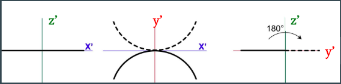
```


### Error A correction -- `correct_errorA` 
If a sample data returned TRUE for error A, the function then changes the sign of the y-value of all the data points, as a result flipping the y-axis. As shown in the following code, originally y = y - vertex[2]. We flipped the y-axis by reversing its value: y =  vertex[2] - y. 

```{r eval=FALSE, include=TRUE}
if (correctionA == TRUE){
    data <- data %>%
      mutate(x = x - vertex[1], y =  vertex[2] - y , z = z - z_mean$z_mean)
  } else {
    data <- data%>%
      mutate(x = x - vertex[1], y = y - vertex[2], z = z - z_mean$z_mean)
  }
```


### Check for error B -- `is_errorB`
Error B is identified as having curvature in the xy-plane as shown in Figure 7. A correct PCA orientation will output a horizontal, flat linear line in xz-plane, meaning that the quadratic coefficient for the quadratic model in the xz-plane is zero. However, it is not practical to expect the quadratic coefficient to be perfectly zero with no variance. Therefore, we construct a normal range for the quadratic coefficient. We achieve good quadratic model fit for wild-type samples, having adjusted $R^2 > 0.85$. Also, we do not observe an obvious curvature of the data points in the xz-plane. Thus, we use wild-type samples as our reference group to construct the normal range for the quadratic coefficient.


```{r Figure7, echo =FALSE, fig.cap="Error B in 3-D", out.width='90%', fig.show='asis'}
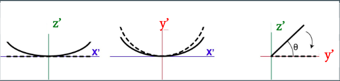
```

To do this, we first identify the standard error of the quadratic coefficient for all of our wild-type samples. Then, we construct a range: (mean - standard error, mean + standard error) as the range of  “acceptable” curvature for wild-type samples. Then, we check whether the quadratic coefficient of each mutant sample is within that range. If it is, we would consider the curvature of that mutant sample acceptable, meaning that there is not an error B for that sample. If the quadratic coefficient of a mutant sample is not within the acceptable range, we would then consider that there exists an error B in the sample. 

We introduce three different ranges to be considered as a normal range:     
1. Interquartile Range (IQR), calculated as the difference of quartile three and quartile one. Quantile 1 as the lower bound and quantile 3 as the upper bound.     
2. Outlier range, calculated from the IQR. `mean - 1.5*IQR` as the lower bound and `mean + 1.5*IQR` as the upper bound. Any data that’s outside this range is considered as outlier.     
3. 95% Confidence interval. 


As shown in Figure 8. The range between the two blue lines indicates the outlier range, followed by red lines as IQR range, and then green lines as 95% confidence interval. We set the outlier range as our default range. Users are able to decide which type of range they want to use. With a wider range, more wild-type samples will be identified in the normal range and more mutant-type samples will be identified in the normal range.

```{r Figure8, echo =FALSE, fig.cap="Normal range of the quadratic coefficient", out.width='90%', fig.show='asis'}
knitr::include_graphics("visualization_paper/range_for_is_errorB.png")
```

### Error B correction - `correct_errorB`
Figure 9 shows our rotation method. 

```{r Figure9, echo =FALSE, fig.cap="Procedures for checking and correcting error B", out.width='90%', fig.show='asis'}
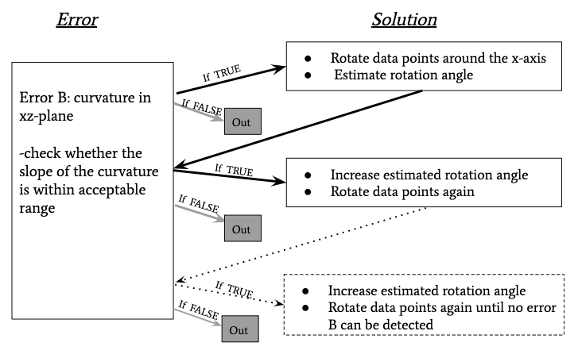
```

After identifying the curvature in the xz-plane, we correct the error by rotating data points a certain angle around the x-axis. 

#### Step 1. First, we use $\alpha$ to estimate rotation angle $\theta$

As shown in Figure 10, we fit a quadratic model on the xz-plane $z=x^2+x$.  $\theta$ is our rotation angle. All the data points are rotated $\theta$ degree around the x-axis in order to correct error B in order to flatten the curvature in the xz-plane. Since the dotted line $l1$ is parallel to $l3$, angle $\beta$ = $\alpha$ according to a parallel-line-theorem, which states that “if lines are parallel and cut by a transversal line, then the corresponding angles are equal”. Thus, we are able to use $\alpha$ to estimate our rotation angle $\theta$.

```{r Figure10, echo =FALSE, fig.cap="Rotation angle estimation", out.width='90%', fig.show='asis'}
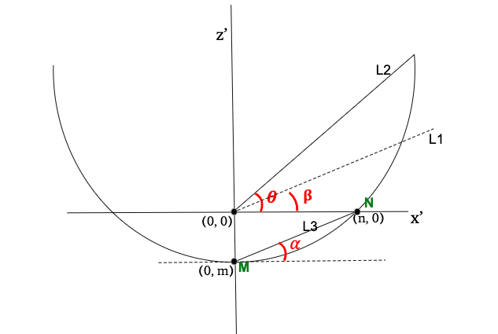
```

#### Step 2. Find $\alpha$ 
Let the quadratic equation to be $y=ax^2 + bx +c$. Let $a$ to be the quadratic coefficient, let $b$ to be the slope, let $c$ to be the intercept. 
We can find the y intercept by setting $x=0$. Similarly, we calculate the x intercept using this formula: $$\frac{-b-sqrt(b^2-4ac)}{2a}$$ We only consider the positive x-intercept here since the x-intercepts are symmetric about y-axis, which serve their purposes the same.   

Let M be the y-intercept with coordinate $(0, m)$. Let N be the x-intercept with coordinate $(n, 0)$. We can use formula $$\frac{y2-y1}{x2-x1}$$ to find the slope of $l3$, which connects points M and N. After simplification, we get the slope of L3 to be $\frac{m}{n}$. We use the formula angle =$tan^{-1} \times$ slope of a line to find the angle $\alpha$.


#### Step 3. Use the estimated angle $\alpha$ to perform rotation
We rotate our data points around the x-axis by performing matrix multiplication: multiplying our current data with the rotation matrix $R_z(\theta)$ shown in Figure 11.  $\theta$ in the $R_z$ is the rotation angle. We plug in our estimated rotation angle $\alpha$ into the rotation matrix $R_z(\theta)$. 

```{r Figure11, echo =FALSE, fig.cap="Rotation matrix", out.width='30%', fig.show='asis'}
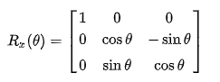
```

We convert our dataframe to a matrix with dimensions $n \times 3$, where n is the number of data points in a dataframe. We then multiply our $n \times 3$ data matrix by our rotation matrix. The output is a matrix with rotated data points in dimension $n \times 3$. 

#### Step 4. Evaluation and reorientation
We check whether the reoriented data has error B, if there is an error, we will re-apply the rotation by doubling the rotation angle until we are cleared for error B. Every time we re-apply the rotation, we increase the rotation angle: for the $i^{th}$ time of re-orientation, we would multiply $i^{th}$ to our original rotation angle $\alpha$.


# Results
## 1. Threshold Optimization Evaluation

### a. Number of signals
Different thresholds will leave us with different number of signals per sample. Figure 12 shows us the boxplot of the average number of signals for wild- and mutant-type samples at each threshold. For each threshold, wild-type samples have a lot more number of signals than mutant-type samples. Note that at threshold 0.9, the average number of signals for mutant-type samples almost equal to zero. At threshold of 0.92, we find that some mutant-type samples do not have any signals left. In the following section, we will compare the model fit for wild-type samples and mutant samples at each threshold.    

```{r Figure12, echo =FALSE, fig.cap="", out.width='60%', fig.show='asis'}
knitr::include_graphics("visualization_paper/thresh_numsig_boxplot.png")
```


### b. Optimal threshold for wild- and mutant-type samples  
We use Qmodel, a quadratic model fitted on the xy-plane, to evaluate model performance at each threshold. First, we fit the `Qmodel` on all samples. For each threshold, we take an average of the adjusted $R^2$ for all wild-type samples, and an average of the adjusted  $R^2$ for all mutant-type samples. 

Figure 13 shows the model adjusted $R^2$ at different thresholds for wild- and mutant-type samples. The model fits pretty well on wild-type samples in general: majority of the samples achieve adjusted $R^2 > 0.75$. However, for mutant samples, not only does the model not perform ideally, but the variance of the adjusted $R^2$ for the samples at each threshold is high. Based on the averaged adjusted $R^2$, we observe that the thresholds between 0.87 to 0.9 yield the best model fit for wild-type samples, whereas we are not able to determine a threshold that yields the best model fit for mutant samples. 

```{r Figure13, echo =FALSE, fig.cap="Adjusted R2 comparison for different threshold for wild-and mutant-type samples", out.width='90%', fig.show='asis'}
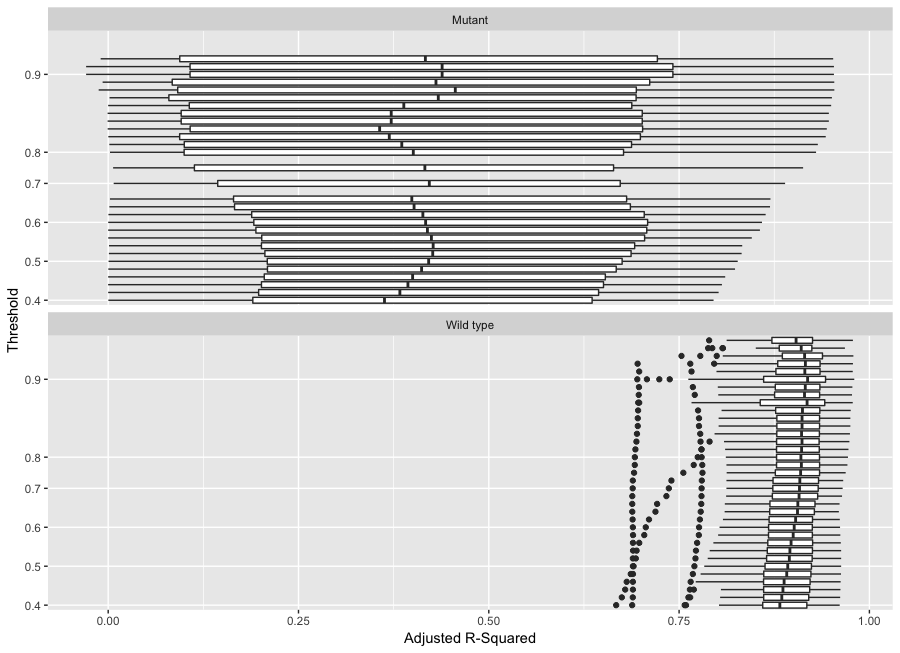
```

### c. Find optimal threshold for both wild- and mutant-type samples
In order to compare wild- and mutant-type samples, the threshold needs to be the same for both types. As mentioned in the Functionalities section earlier, Euclidean distance is used to compare the performance of the model on our sample for each threshold with the perfect model fit. We calculate this Euclidean distance to determine the optimal threshold for both types of samples. The Figure 2 shows that the thresholds between 0.90 and 0.92 achieve the optimal model fit, having the smallest Euclidean distance. However, as mentioned in section “a. Number of signals”, the average number of signals of mutant-type samples is very low once threshold reaches 0.9. At threshold=0.9, the average number of signals of mutant-type samples drops to 303 ($SD$ = 299), which poses a threat of the model overfitting the data. Overfitting underestimate the true error of the data, which occurs in our case when the sample size is small. In order to avoid overfitting our data, we want to ensure that for each sample there are enough number of signals. As shown in Figure 2, threshold of 0.6 is located at the peak of the curve, which is the threshold that gives the smallest Euclidean distance after 0.9 to 0.92 thresholds. Thus, we propose a new optimal threshold of 0.6. 

## 2. PCA Reorientation Model Fit Evaluation
We compare the adjusted $R^2$ of the model before and after PCA reorientation, and we find that PCA transformation significantly improved the model fit. 

For Figures 14 and 15 each point represents a wild-type sample or a mutant-type sample. The x-axis gives the adjusted $R^2$ before PCA reorientation and the y-axis gives the adjusted $R^2$ after PCA reorientation. The red line $y=x$ is plotted in both figures, which informs whether the PCA improves the quadratic model fit: the samples below the red line perform worse after the PCA reorientation and the samples above the red line perform better after the PCA reorientation.


```{r Figure14, echo =FALSE, fig.cap="PCA ", out.width='60%', fig.show='asis'}
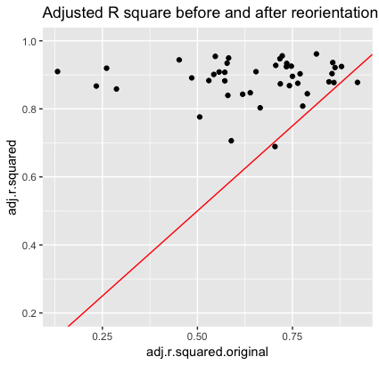
```

```{r Figure15, echo =FALSE, fig.cap="", out.width='60%', fig.show='asis'}
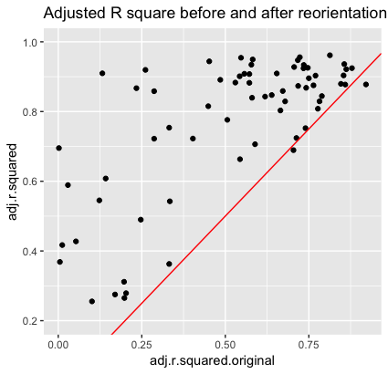
```


In order to compare the difference in the model fit before and after PCA reorientation, we perform paired sample t-tests on wild- and mutant-type samples for threshold  0.6. 
```{r eval=FALSE, include=TRUE}
t.test(data$adj.r.squared.original, data$adj.r.squared, paired = TRUE, 
       alternative = "two.sided")
```


For wild-type samples, the adjusted $R^2$ after PCA reorientation is significantly higher than the average adjusted $R^2$ before PCA reorientation with a p-value =$5.765^{-10}$. For mutant-type samples, it was found that the adjusted $R^2$ after PCA reorientation is significantly higher than the average adjusted $R^2$ before PCA reorientation with a p-value = $1.863^{-4}$. The result demonstrates the importance of PCA reorientation.

PCA reorientation performs better on the wild-type samples. As shown in the Figure 14 and Figure 15, for both wild- and mutant- type samples, those with high original adjusted $R^2$s have much higher adjusted $R^2$s after the PCA reorientation. Wild-type samples with low original adjusted $R^2$s have much higher adjusted $R^2$s after the PCA reorientation. However, many mutant-type samples with low original adjusted $R^2$s only achieve slight improvements on their adjusted $R^2$s. 

# Conclusion
## Conclusion
The three major improvements we make in the `Cranium` functionalities include:    
1. Data accessibility     
2. Reduce user bias: minimize user input, reduce user bias    
3. Easy for researchers to explore the data      

In recent years, more researchers aim to produce reproducible and open-source results. By storing the data using an API key, we solve the problem of physically transferring the data using hard drives and therefore making it possible for more researchers to examine zebrafish commissure structures using the same data. We implement a systematic optimization process to reduce user input, therefore minimizing the amount of subjectivity involved in the data reorientation process. Also, `Cranium` is easier to manipulate and requires little background in programming languages to use. As a result, it allows and encourages life science researchers to analyze 3D data independently. 

## Future research
PCA alignment error detection and correction could be optimized in the future. After the correction A, which addresses the flipped y-axis error and correction B, which addresses the curvature in the xz-plane problem, we would like to see whether the quadratic model fit on our wild- and mutant-type samples would be improved from the model fit on the samples before our corrections.  


# References {#references .unnumbered}


