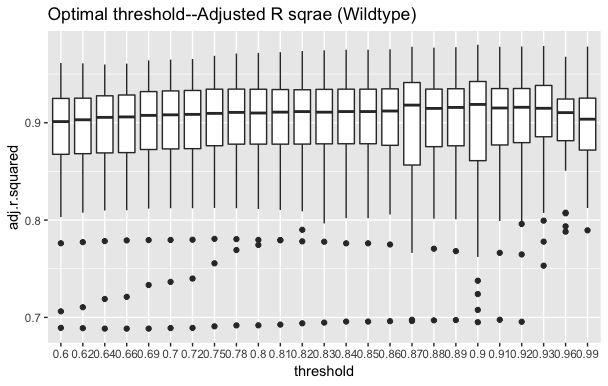
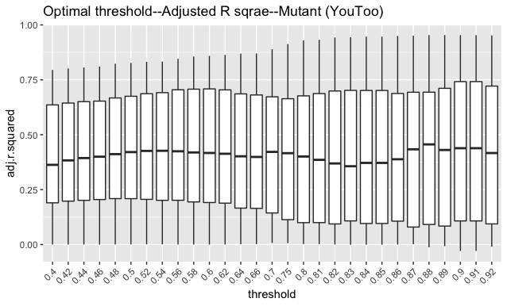
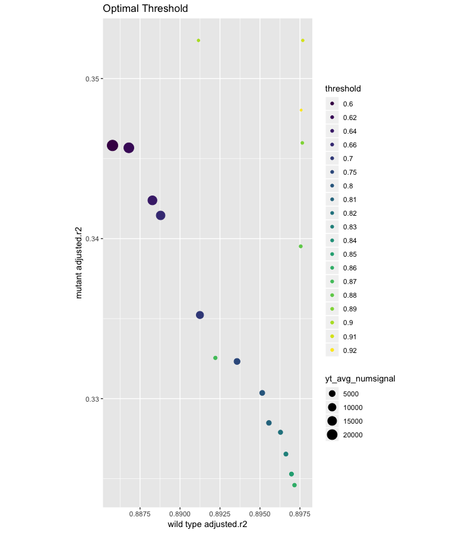

```{r global_options, include=FALSE}
knitr::opts_chunk$set(fig.pos = 'H')
```

# Introduction

The current study serves as an enhancement to Dr. Michael Barresi’s research at Smith College on categorizing zebrafish brains. The goal of his research is to use the commissure, an axonal bridge formed to connect the two hemispheres of the brain, to classify whether a certain zebrafish belongs to wild type or mutant group. 


```{r Figure1, echo =FALSE, fig.cap="Wild Type and Mutant Commissure", out.width='90%', fig.show='asis'}
knitr::include_graphics("visualization_paper/wt_yt.png")
```


The difference between wildtype and you-too is shown above. Wild type zebrafish has a smooth parabolic-shaped commissure, where as in mutant (you-too) zebrafish, the commissure is either not fully developed or highly distorted.


During the classification process, instead of following a systematic approach, Dr. Barresi’s lab could only perform categorization based on empirical knowledge. As a result, Morgan Schwartz, a former lab member wrote a Python program called deltascope to: 1. Align crooked 3D biological images so they could compare between samples; 2. Generate descriptive graphs with sample statistics; 3. Classify samples into either wild type or mutant group based on the statistics[@Schwartz18] [@Hu18]. Our goal is to “transfer” the Python program into R while maintaining and improving as many features as possible. We modified existed functions in Cranium package, built new functions and optimized parameters so that evaluating sample alignments is no longer vulnerable to subjective biases. Additionally, alignments will be able to run automatically without labor-intensive manual correction that would introduce more researcher biases.

# Data
We received our data from Dr. Jake Schnabl: 43 wild type samples and 35 mutant samples. The data files are in HDF5 (.h5) format. The data points stored within those files are marked using by fluorescence microscopy, indicating neuronal signals. The data is processed by an open-source software, Ilastik, before being read into R. We are working with the data after processed in Ilastik.    

Raw image data was processed in Illastik. Each sample is composed of data points, which are pixels of the image. Each pixel has a frequency, which represents the probability of being a real signal. Each data point in our dataset represents one signal, and the signals have different frequencies. 


# Methods


## Programming Languages
In this study, we used R in order to run algorithms, manipulate data, and generate visualizations.
For accessibility and reproducibility of this research, we have stored our work on Github. [@rticles19]

## Package `Cranium`
The package `Cranium` contains several major functionalities listed below:


### 1. API
The sample datasets for You Too and Wild Type are saved as *.h5 files. In order to share the data efficiently amongst users, the data is hosted on Amazon s3 with a readonly link to each sample. Rather than users individually grabbing each sample, there were functions created in the cranium R package that allows users to download a bundle of samples per type (i.e., You Too and Wild Type). Each function downloads all existing files onto the user’s machine in a designated folder the user decides in addition to outputting the list of samples of type brain class. Prior to these new functions, the Barresi lab had to share the samples through a hard drive, thus the new features solve the issue on how to share data efficiently. 

### 2. Tidy Data and Threshold
After reading in the data, tidy function not only converts the original data to x, y, z coordinates of each signal, but also includes the signal’s frequency. Now the data is assigned as a tidy brain class.   

Frequency represents the probability of each pixel being a real signal. We want to include as many “real” signals as possible while getting rid of signals that are very likely to be “background noise.” To do this, we tested different thresholds and examined model fit. Signals with frequency lower than the threshold are pruned out, leaving us with “real” signals in our data. For example, before we attempted to optimize threshold level, deltascope treated 0.9 as the standard threshold. After setting the threshold, individual signals undergo a binary classification procedure: signals that have frequencies higher than 0.9 are considered as “real” signals whereas signals that have frequencies lower than 0.9 are pruned out as “background noise.”    

We tested different thresholds for both wild type and mutant (you-too), separately. Since wild type commissures more or less follow a parabolic pattern, setting a high threshold would not result in too few data points (i.e., signals). However, setting a high threshold for mutant type data would result in a very restricted sample size, thus increasing the chance of our model overfitting the data. At the same time, setting a low threshold for mutant type data, while increases the sample size, allows more noise to creep into the dataset.    


### 3. Principal Component Analysis Transformation
We can’t ensure the samples are mounted exactly the same. Therefore, the pictures taken are of different angles and coordinates. In order for us to do further analyses and compare between samples, we need to re-orient them using Principal Component Analysis (PCA) and identify a consistent set of axes across all samples. 
PCA assigns the axis with the most amount of variation as PC1 (first principal component), the axis with the second-most variation as PC2, and the axis with least amount of variation as PC3. Since we are performing the PCA in a 3D space, PCA would output three 2D planes from three perspectives: xy; yz; xz planes. For the commissure, we would get 3 views: lateral; dorsal/ventral; anterior/posterior. We set x axis as the lateral, y axis as the anterior/posterior, and z as the dorsal/ventral.   


### 4. Qmodel
We built the Qmodel function to fit a quadratic model to the data in order to capture the shape of the commissure as well as evaluating model fit. The quadratic model fits on the xy plane. Our goal is to have the best model fit. Qmodel outputs model statistics including: $r^2$ , adjusted $r^2$ , sigmal (RSE), statistic, p.value, df, logLik, AIC, BIC, deviance, df.residual, num.signal, quad.coeff, RMSE. 
### $r^2$ : 
Also called the coefficient of determination or the coefficient of multiple determination for multiple regression. $r^2$  ranges from 0 to 1.  It is calculated from the variance explained by the model divided by total variance. Higher $r^2$  values represent smaller differences between the observed data and the fitted values, indicating a better fit of the model. Note that $r^2$  is a relative scale of model fit. 

### Adjusted $r^2$ : 
Based on $r^2$ , adjusted $r^2$ --adjusts for the number of terms in the model, the degrees of freedom.

### RMSE (Root Mean Squared Error)
gives the difference between observed data and model’s predicted values. Lower RMSE values represent smaller difference between observed data and model’s predicted values.

### Sigma
It is the square root of the estimated variance of the residuals

### Statistic
A piece of data that is related to a larger set of data

### P.value
It is the probability that chance alone would produce a test statistic as extreme as the observed test statistic. 

### Df
Degrees of freedom 

### logLik 
A function in R that determines the log likelihood of a fitted model.

### AIC
Akaike information criterion represents the estimate in quality of model relative to other models.

### BIC
Bayesian information criterion (BIC) or Schwarz information criterion

### Deviance
A value of goodness-of-fit for a statistical model.

### df.residual
Residual degree of freedom

### num.signal 
It gives the number of signals being captured for the sample after filter out the signals that are less than the threshold.

### Quad.coeff
The quadratic coefficient of the model $y=x^2+x$.


### 5. Linear Model
A good PCA transformation will result in mean z value to be zero. Thus, we build linear model $z=0$  to evaluate the PCA transformation. Visually, we will observe the line at $z=0$ on the xz plane and yz plane if PCA is transformed correctly. A bad fitted linear model is indicated by having a curvature in the xz plane and yz plane, which could cause by rotation around x axis or an incorrectly selected PC1 (first principal component). 

### 6. Plotting


# Results

## 1. Threshold optimization evaluation

### Wild Type
For wild type sample, we tested threshold 24 different threshold: threshold = {0.6, 0.62, 0.64, 0.66, 0.69, 0.7, 0.72, 0.75, 0.78, 0.8, 0.81, 0.82, 0.83, 0.84, 0.85, 0.86, 0.87, 0.88, 0.90, 0.91, 0.92, 0.93, 0.96, 0.99}. Next, we fit the qmodel to each sample and for each threshold value. We are able to find the threshold for each sample that gives the highest adjusted $r^2$ . 4 (16.3%)  sample achieved their highest adjusted $r^2$  when setting threshold 0.87; 11 (25.6%) samples achieved their highest adjusted $r^2$  when setting threshold 0.9; 6 (14.0%) samples achieved their highest adjusted $r^2$  when setting threshold 0.92; 9 (20.9%) samples achieved their highest adjusted $r^2$  when setting threshold 0.93.  Boxplots in Figure 2 show the  adjusted $r^2$  for each threshold value. We had good model fit for all thresholds, and the mean adjusted $r^2$  is 0.9. The adjusted $r^2$  is slightly higher for threshold 0.87 and 0.9. Thus, we conclude that the range of optimal thresholds for wild type is between 0.87 and 0.9


```{r Figure2, echo =FALSE, fig.cap="Optimal threshold--Adjusted r2 (Wild Type)", out.width='90%', fig.show='hold'}

```


### Mutant 
For mutant sample, we tested 29 different thresholds: threshold = {0.4, 0.42, 0.44, 0.46, 0.48,  0.5, 0.52, 0.54, 0.56, 0.58, 0.6, 0.62, 0.64, 0.66,  0.7, 0.75, 0.8, 0.81, 0.82, 0.83, 0.84, 0.85, 0.86, 0.87, 0.88, 0.89, 0.9, 0.91, 0.92}. Next, we fit the qmodel to each sample and for each threshold value. We are then able to find the optimal threshold for each sample that gives the highest adjusted $r^2$  value. According to Figure 2,  x-axis is showing different thresholds and y-axis gives us the adjusted $r^2$ . Each line represents a mutant sample. The range of the adjusted $r^2$  is very large, indicating large number of  samples having poor model fit. 


According to Figure 3, we show the boxplots of adjusted $r^2$  for each threshold value. Changing threshold is not improving model fit significantly. Thus we can’t conclude an optimal threshold for the mutant samples.

```{r Figure3, echo =FALSE, fig.cap="Optimal threshold--Adjusted r2--Mutant(You Too)", out.width='90%'}

```


### Threshold Optimization
And then we compared model fit of wild type and mutant sample by comparing their average adjusted $r^2$  for each threshold. For each threshold, we computed the average adjusted $r^2$  for 43 wild type samples and the average adjusted $r^2$  for 35 mutant samples. 
As shown in Figure 4, x-axis represents the average adjusted $r^2$  for wild type and the y-axis represents the average adjusted $r^2$  for mutant type. A perfect model fit will have x=1 and y=1, and our goal is to identify the point that has the smallest Euclidean distance to (1,1).

```{r Figure4, echo =FALSE, fig.cap="Optimal Threshold", out.width='100%'}

```


## 2. PCA Transformation Model Fit Evaluation
We compared the adjusted $r^2$  of the model before and after PCA transformation, and found out that PCA transformation significantly improved the model fit. 

### Wild Type
We performed paired sample t-test on the wild type samples by setting default threshold 0.9. As shown in Figure 5, the x-axis shows the adjusted $r^2$ before the PCA reorientation, and y-axis shows the adjusted $r^2$ after the PCA reorientation. Each point represents a signal in the wild type sample. It was found that the average adjusted $r^2$ after PCA transformation is significantly higher than the average adjusted $r^2$  before PCA transformation with a p-value =$5.765^{-10}$. The result ensures the importance of PCA transformation.    
```{r Figure5, echo =FALSE, fig.cap="Adj. r2 before and after PCA reorientation (wild type)", out.width='90%'}
knitr::include_graphics("visualization_paper/r2_ro_comparison_wt.png")
```


### Mutant 
We performed paired sample t-test on the wild type sample by setting optimal threshold 0.8.  As shown in Figure 6, the x-axis shows the adjusted $r^2$ before the PCA reorientation, and y-axis shows the adjusted $r^2$ after the PCA reorientation. Each point represents a signal in the mutant sample.It was found that the average adjusted $r^2$ after PCA transformation is significantly higher than the average adjusted $r^2$ before PCA transformation with a p-value = $1.863^{-4}$. The result ensures the importance of PCA transformation.

```{r Figure6, echo =FALSE, fig.cap="Adj. r2 before and after PCA reorientation (mutant)", out.width='90%'}
knitr::include_graphics("visualization_paper/r2_ro_comparison_yt.png")
```


# References {#references .unnumbered}
