```{r global_options, include=FALSE}
knitr::opts_chunk$set(fig.pos = 'H')
```


# Abstract
# Introduction

```{r Figure1, echo =FALSE, fig.cap="Wild Type and Mutant Commissure", out.width='90%', fig.show='asis'}
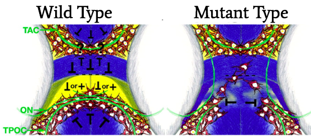
```

# Data
# Programming Languages
# Pre-Correction

```{r Figure2, echo =FALSE, fig.cap="", out.width='90%', fig.show='asis'}
knitr::include_graphics("visualization_paper/optimal_threshold2.png")
```

# Correction
```{r Figure3, echo =FALSE, fig.cap="", out.width='90%', fig.show='asis'}

```

```{r Figure4, echo =FALSE, fig.cap="", out.width='90%', fig.show='asis'}
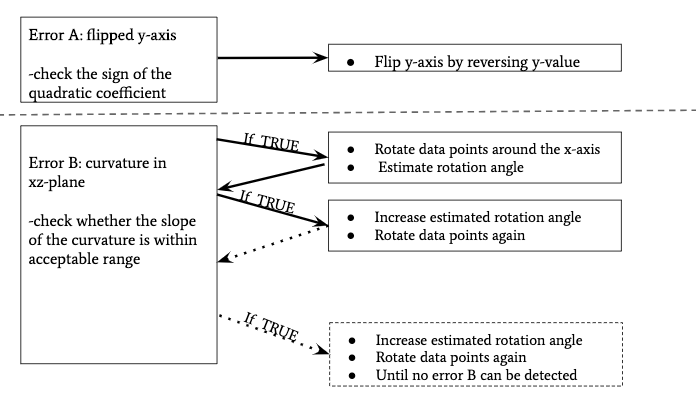
```

```{r Figure5, echo =FALSE, fig.cap="", out.width='90%', fig.show='asis'}
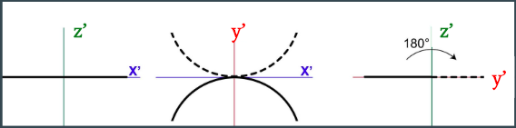
```

```{r Figure6, echo =FALSE, fig.cap="", out.width='90%', fig.show='asis'}
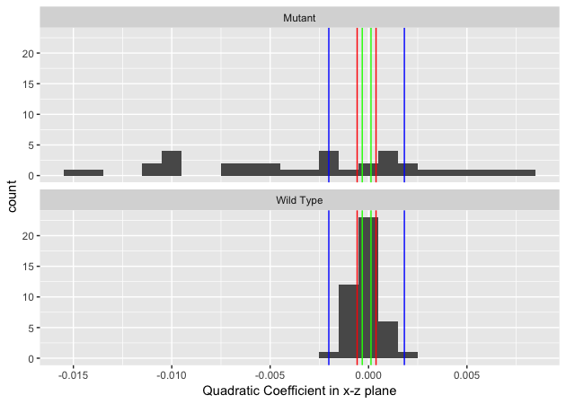
```

```{r Figure7, echo =FALSE, fig.cap="", out.width='90%', fig.show='asis'}
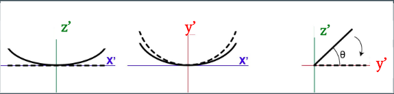
```

```{r Figure8, echo =FALSE, fig.cap="", out.width='90%', fig.show='asis'}
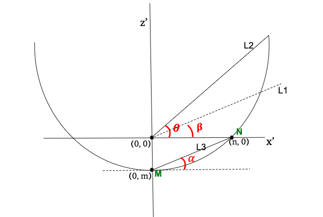
```

```{r Figure9, echo =FALSE, fig.cap="", out.width='50%', fig.show='asis'}
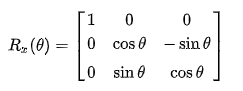
```

# Results

```{r Figure10, echo =FALSE, fig.cap="", out.width='90%', fig.show='asis'}
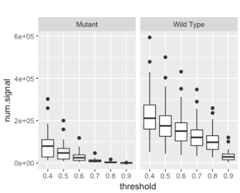
```

```{r Figure11, echo =FALSE, fig.cap="", out.width='90%', fig.show='asis'}
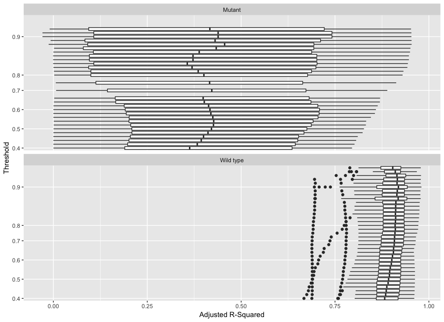
```

```{r Figure12, echo =FALSE, fig.cap="", out.width='90%', fig.show='asis'}
knitr::include_graphics("visualization_paper/optimal_threshold2.png")
```

```{r Figure13, echo =FALSE, fig.cap="", out.width='80%', fig.show='asis'}
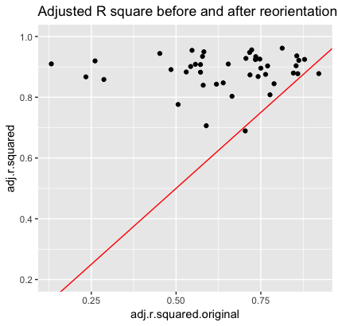
```

```{r Figure14, echo =FALSE, fig.cap="", out.width='80%', fig.show='asis'}
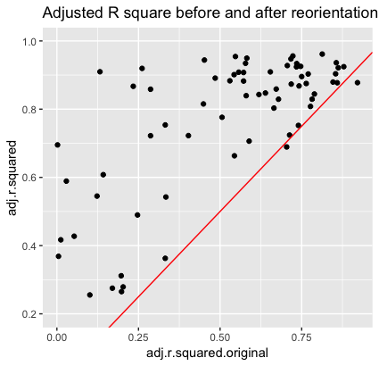
```

# Conclusion

# Future Research
```{r Figure15, echo =FALSE, fig.cap="", out.width='90%', fig.show='asis'}
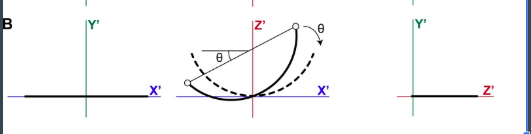
```