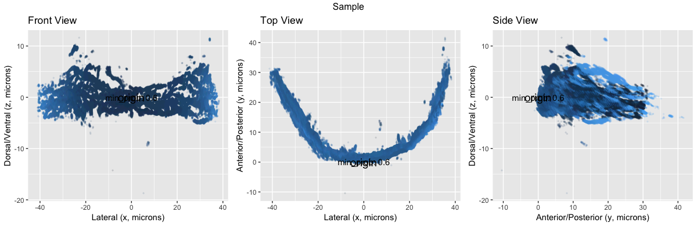
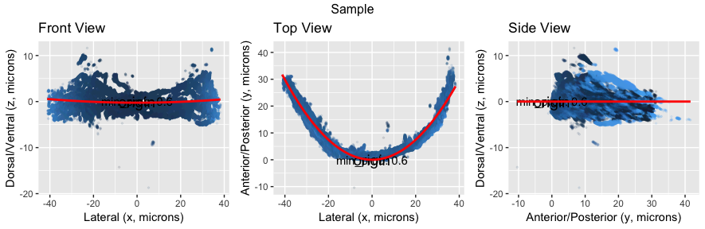

$\Delta$ 

```{r global_options, include=FALSE}
knitr::opts_chunk$set(fig.pos = 'H')
```

# Introduction

The current study serves as an enhancement to Dr. Michael Barresi’s research at Smith College on categorizing zebrafish brains. The goal of the biological sciences research is to use the commissure, an axonal bridge formed to connect the two hemispheres of the brain, to classify whether a certain zebrafish belongs to wild- or mutant-type group.    

The difference between wild- and mutant-type brain structure is shown in Fig.1. Wild-type zebrafish have a smooth parabolic-shaped commissure, where as in mutant zebrafish, the commissure is either not fully developed or highly distorted.


```{r Figure1, echo =FALSE, fig.cap="Wild-type and mutant-type commissure", out.width='90%', fig.show='asis'}
knitr::include_graphics("visualization_paper/wt_yt.png")
```


During the classification process, Dr. Barresi’s lab could only perform categorization based on empirical knowledge. As a result, Morgan Schwartz, a former lab member, wrote a Python program called $\Delta$ SCOPE to:     
1. Align crooked 3D biological images so they could compare between samples           
2. Generate descriptive graphs with sample statistics        
3. Classify samples into either wild type or mutant type based on the statistics[@Schwartz18] [@Hu18].       

Our goal is to implement the Python program into R while maintaining and improving as many features as possible. We modified existing functions in `Cranium` package, built new functions, and optimized parameters so that evaluating sample alignments is no longer vulnerable to subjective biases. Additionally, alignments will be able to run automatically without labor-intensive manual correction that would introduce more researcher biases.


# Data
We received our data from Dr. Jake Schnabl. The data files are brain images of 43 wild-type samples and 35 mutant samples in HDF5 (.h5) format. The data points stored within those files are marked using by fluorescence microscopy, indicating neuronal signals. The data is processed by an open-source software, Ilastik, before being read into R. We are working with the data after being processed in Ilastik.      

Raw image data was processed in `Illastik`. Each sample is composed of data points, which are voxels of the image. Voxels stand for volumetric pixels, which can be understood as the three-dimensional equivalent of pixels. Each voxel has a frequency, representing the probability of being a real signal.    

# Programming Languages
In this study, we used R in order to run algorithms, manipulate data, and generate visualizations. For accessibility and reproducibility of this research, we have stored our work on Github. [@rticles19]

## Package `Cranium`
The package `Cranium` contains several major functionalities listed below:


# Functionalities
## 1.API
The sample datasets for wild- and mutant-type are saved as `*.h5` files. Originally, the lab had to share the data through a hard drive, thus having a need for readily accessible data. In order to share the data efficiently amongst users, the data is hosted on Amazon S3 with a read only link to each sample. In the `Cranium` package,  functions were created that allows users to download an individual sample or a bundle of samples.. Each function downloads all existing files onto the user’s machine in a designated folder the user decides in addition to outputting the list of samples of type brain class. 

## 2. Tidy Data and Threshold
After reading the data, we organize the dataset using a tidy framework for data manipulation, which has a specific structure: each row is an observation and each column is a variable; in our case, `x,y,z` coordinates [@tidy-data]. After transforming the image data, each observation in our data is a voxel, and each voxel contains information about how strong that voxel is, which is referred to as frequency. Frequency represents the probability of each voxel being a real signal. We want to include as many “real” signals as possible while getting rid of voxels that are very likely to be “background noise.” Therefore, we want to set a threshold so that all the voxels that have frequencies below the threshold are considered as noise and excluded from our analysis. 

Wild-type samples and mutant-type samples originally contain different number of voxels. Because of the deformed nature of mutant-type commissures, mutant samples, on average, contain half or fewer voxels than that of wild type. Also, compared to wild-type samples, mutant-type samples’ voxels generally have lower frequencies. Setting a high threshold would not result in too small a sample size (i.e., signals) for the wild type because the wild-type commissures are mostly formed successfully and have relatively strong signals. However, a high threshold would result in mutant-type sample having a very restricted sample size because the wild-type commissures are mostly formed successfully and have relatively strong signals. 

For the purpose of research of Baressi’s Lab, we want to compare wild- and mutant-type sample, thus we have to set the same threshold for both types of samples. A threshold of 0.9 was subjectively chosen previously by observing the output of wild- and mutant-type samples, which raised our concern of the validity of this threshold. Therefore, we decided to 1. test for the validity of this 0.9 threshold by examining model fit; 2. find a threshold that will optimize the model fit. We fit a quadratic model on the x-y plane that captures the shape of the commissure, and we use the adjusted $R^2$ to evaluate the model fit. There are some problems we encounter during the optimization process: having small number of signals for mutant-type samples increases the chance of our model overfitting the data; meanwhile, setting a low threshold for mutant-type samples increases the the chance of noise to creep into the dataset. Therefore, our goal is find the optimized threshold that fit the data well by capturing the real signals, while ensuring that we have enough mutant-type signals. 

To find the optimal threshold, we test different thresholds and examine their model fit according the following procedures:     
1. Starting with one threshold, we fit one model to every single sample and repeat fitting the model for all wild- and mutant-type samples. We then evaluate the model fit at this specific threshold by respectively taking the average $R^2$ of the wild-type and of the mutant-type samples.     
2. Next, we repeat step 1. for other thresholds: {0.4, 0.42, 0.44, 0.46, 0.48,  0.5, 0.52, 0.54, 0.56, 0.58, 0.6, 0.62, 0.64, 0.66,  0.7, 0.75, 0.8, 0.81, 0.82, 0.83, 0.84, 0.85, 0.86, 0.87, 0.88, 0.89, 0.90, 0.91, 0.92}.      
3. For each threshold, we generate a table of the threshold which we listed at step 2. with its corresponding average adjusted $R^2$ for wild-type samples and average adjusted $R^2$ for mutant-type samples.

In order to find the threshold that optimizes the average adjusted $R^2$ for both wild- and mutant-type samples, we generate a scatterplot, as shown in Figure 2, for each threshold value, which is represented by a distinct color. The use of lighter color indicates a higher threshold. The size of each point represents the amount of signals from the mutant-type sample that were captured by the model. With x-axis representing the average mutant-type adjusted $R^2$ and y-axis representing the average wild-type adjusted $R^2$, we are able to find the optimal threshold.     


```{r Figure2, echo =FALSE, fig.cap="Optimization of threshold for wild- and mutant-type samples", out.width='90%', fig.show='asis'}
knitr::include_graphics("visualization_paper/optimal_threshold2.png")
```


We evaluate the performance of each threshold by comparing it to the perfect model fit. A perfect model-fit for both wild- and mutant-type samples should achieve an adjusted $R^2 = 1$. In a two dimensional space, we can find the Euclidean distance between the model fit of our threshold and the perfect model fit. A smaller euclidean distance indicates that we are closer to the perfect model fit. 

## 3. Principal Component Analysis (PCA) Reorientation
During the process of data collection, researchers took pictures of the zebrafish brain under microscopes. We acknowledge that each of the brains were in different positions and were placed in different angles. Therefore, the pictures varied slightly in positioning. In order for us to do further analyses and compare between samples, we need to re-orient them using Principal Component Analysis (PCA) and identify a consistent set of axes across all samples. 
In a three-dimensional space, PCA assigns the axis with the most amount of variation as PC1 (first principal component), then the axis with the second-most variation as PC2, and lastly the axis with least amount of variation as PC3. Afterwards, PCA picks the basis based on  PC1, PC2, and PC2, which then changes the positioning of the structure. As shown in Figure 3, we graphically output three 2D planes in three perspectives: xy; yz; xz planes. For the commissure, we would get three views: lateral; dorsal/ventral; anterior/posterior. We set x axis as the lateral, y axis as the anterior/posterior, and z as the dorsal/ventral.        


```{r Figure3, echo =FALSE, fig.cap="2-D plot of a wild-type sample #4", out.width='90%', fig.show='asis'}

```


## 4. Qmodel   
We built the Qmodel function to fit a quadratic model to the data in order to capture the shape of the commissure as well as evaluating model fit. As shown in the Figure 4, the quadratic model fits on the xy-plane:  $y=x^2+x$, indicated by red color. Our goal is to achieve a better model fit. Qmodel outputs model statistics including: $R^2$, adjusted $R^2$, sigmal (RSE), statistic, p.value, df, logLik, AIC, BIC, deviance, df.residual, num.signal, quad.coeff, RMSE.    


```{r Figure4, echo =FALSE, fig.cap="Model fit on a wild-type sample #4", out.width='90%', fig.show='asis'}

```
 

### $R^2$ : 
R^2 is also called the coefficient of determination or the coefficient of multiple determination for multiple regression. $R^2$ ranges from 0 to 1.  It is calculated from the variance explained by the model divided by total variance. Higher $R^2$ values represent smaller differences between the observed data and the fitted values, indicating a better fit of the model. Note that $R^2$ is a relative scale of model fit.

### Adjusted $R^2$ : 
Adjusted $R^2$ is a modification of $R^2$ and adjusts for the number of predictors in the model. 

### RMSE (Root Mean Squared Error)
gives the difference between observed data and model’s predicted values. Lower RMSE values represent smaller difference between observed data and model’s predicted values.

### num.signal 
It gives the number of signals being captured for the sample after filter out the signals that are less than the threshold.

### Quad.coeff
It is the coefficient of the $x^2$ term in our model. 


# PCA Reorientation Correction

Errors occur after the PCA reorientation, previously four errors were identified in $\Delta$SCOPE. In our study, we identify two types of error and make corresponding corrections, which is introduced in the following section.
 
## Systematic Correction Procedure
Existing problem: previous research identified four types of errors. However, users had to examine samples one at a time, subjectively make decision on whether that sample has an error and then correct the error with subjective judgment. We introduce a systematic correction procedure as shown in Figure 5, striving to minimize user input in order to reduce subjective biases, by making all the error identification and correction automatic. 

```{r Figure5, echo =FALSE, fig.cap="Systematic correction procedure", out.width='90%', fig.show='asis'}
knitr::include_graphics("visualization_paper/cranium_procedure.png")
```


### Check for error A-- `is_errorA`
As shown in Figure 6, error A is identified as flipped y-axis, shown as the solid curve in the xy-plane. A correct model fit a positive quadratic model in the xy-plane, shown as the dotted curve.  We fit a quadratic model on the xy-plane: $y=x^2 + x$. The positive quadratic coefficient indicates a positive concavity; a negative quadratic coefficient indicates a negative concavity. Having a negative quadratic coefficient is resulted from an PCA reorientation error, which we identify as error A. If error A occurs, the function will show “Y Axis is flipped” and return “TRUE”. If error A does not exist, then the function will show “Correct alignment” and return “FALSE”. 


```{r Figure6, echo =FALSE, fig.cap="Error A in 3-D", out.width='90%', fig.show='asis'}
knitr::include_graphics("visualization_paper/error_correctionA.png")
```


### Error A correction -- `correct_errorA` 
If a sample data returned TRUE for error A, the function then changes the sign of the y-value of all the data points, as a result flipping the y-axis. As shown in the following code, originally y = y - vertex[2]. We flipped the y-axis by reversing its value: y =  vertex[2] - y. 

```{r eval=FALSE, include=TRUE}
if (correctionA == TRUE){
    data <- data %>%
      mutate(x = x - vertex[1], y =  vertex[2] - y , z = z - z_mean$z_mean)
  } else {
    data <- data%>%
      mutate(x = x - vertex[1], y = y - vertex[2], z = z - z_mean$z_mean)
  }
```


### Check for error B -- `is_errorB`
Error B is identified as having curvature in the xy-plane as shown in Figure 7. A correct PCA orientation will output a horizontal, flat linear line in xz-plane, meaning that the quadratic coefficient for the quadratic model in the xz-plane is zero. However, it is not practical to expect the quadratic coefficient to be perfectly zero with no variance. Therefore, we construct a normal range for the quadratic coefficient. We achieve good quadratic model fit for wild-type samples, having adjusted $R^2 > 0.85$. Also, we do not observe an obvious curvature of the data points in the xz-plane. Thus, we use wild-type samples as our reference group to construct the normal range for the quadratic coefficient.


```{r Figure7, echo =FALSE, fig.cap="Error B in 3-D", out.width='90%', fig.show='asis'}
knitr::include_graphics("visualization_paper/range_for_is_errorB.png")
```

To do this, we first identify the standard error of the quadratic coefficient for all of our wild-type samples. Then, we construct a range: (mean - standard error, mean + standard error) as the range of  “acceptable” curvature for wild-type samples. Then, we check whether the quadratic coefficient of each mutant sample is within that range. If it is, we would consider the curvature of that mutant sample acceptable, meaning that there is not an error B for that sample. If the quadratic coefficient of a mutant sample is not within the acceptable range, we would then consider that there exists an error B in the sample. 


```{r Figure8, echo =FALSE, fig.cap="", out.width='90%', fig.show='asis'}
knitr::include_graphics("visualization_paper/diagram_2errors.png")
```


```{r Figure9, echo =FALSE, fig.cap="", out.width='90%', fig.show='asis'}
knitr::include_graphics("visualization_paper/error_correctionB.png")
```

```{r Figure10, echo =FALSE, fig.cap="", out.width='90%', fig.show='asis'}
knitr::include_graphics("visualization_paper/rotation_angle.png")
```

```{r Figure11, echo =FALSE, fig.cap="", out.width='50%', fig.show='asis'}
knitr::include_graphics("visualization_paper/rotation_matrix.png")
```

# Results

```{r Figure12, echo =FALSE, fig.cap="", out.width='90%', fig.show='asis'}
knitr::include_graphics("visualization_paper/thresh_numsig_boxplot.png")
```

```{r Figure13, echo =FALSE, fig.cap="", out.width='90%', fig.show='asis'}
knitr::include_graphics("visualization_paper/threshold_boxplot.png")
```

```{r Figure14, echo =FALSE, fig.cap="", out.width='90%', fig.show='asis'}
knitr::include_graphics("visualization_paper/optimal_threshold2.png")
```

```{r Figure15, echo =FALSE, fig.cap="", out.width='80%', fig.show='asis'}
knitr::include_graphics("visualization_paper/adj_r2_before_after_wt.png")
```

```{r Figure16, echo =FALSE, fig.cap="", out.width='80%', fig.show='asis'}
knitr::include_graphics("visualization_paper/adj_r2_before_after_yt.png")
```

# Conclusion


